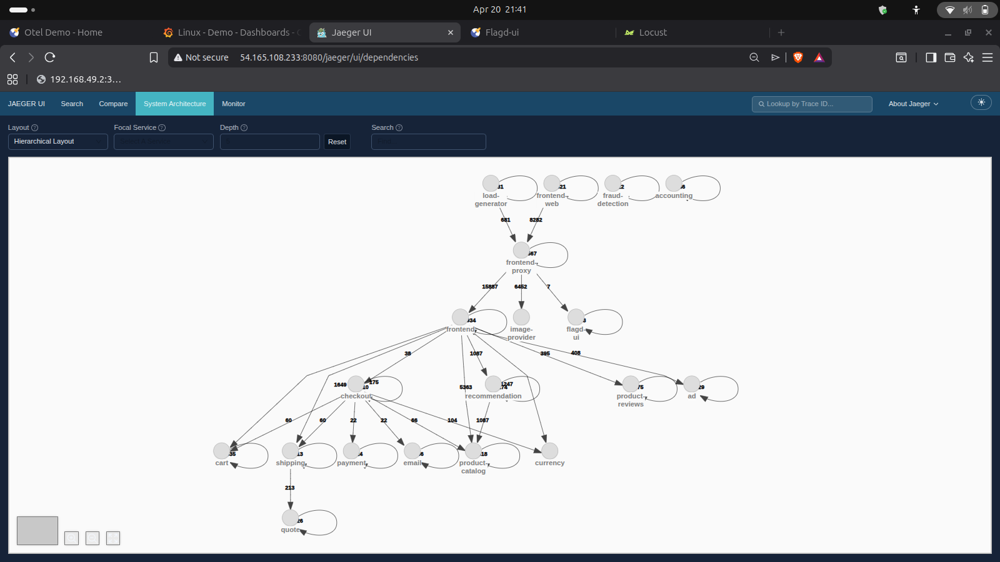
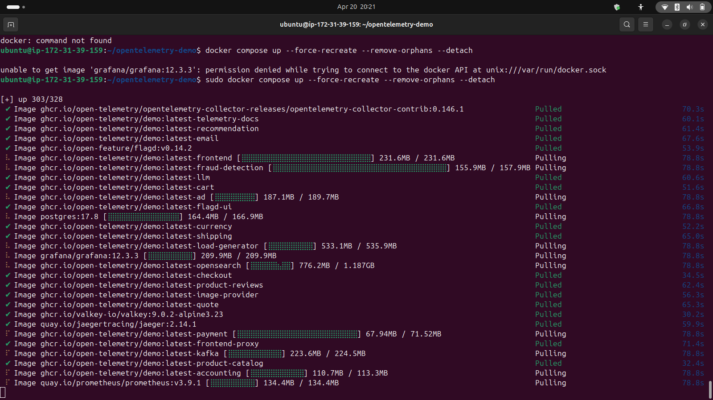
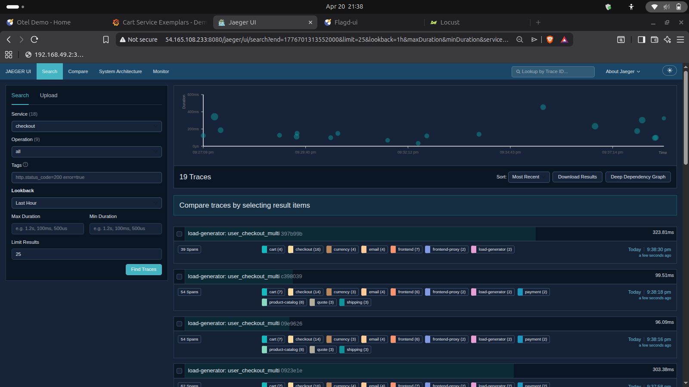
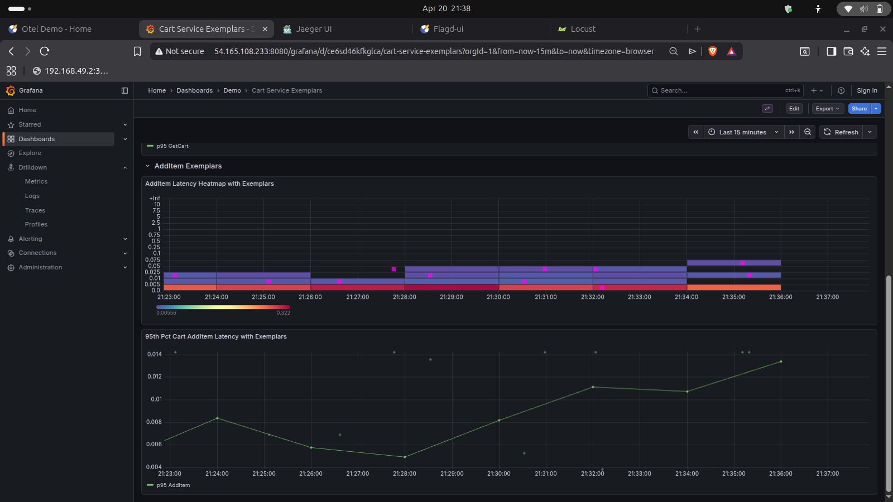
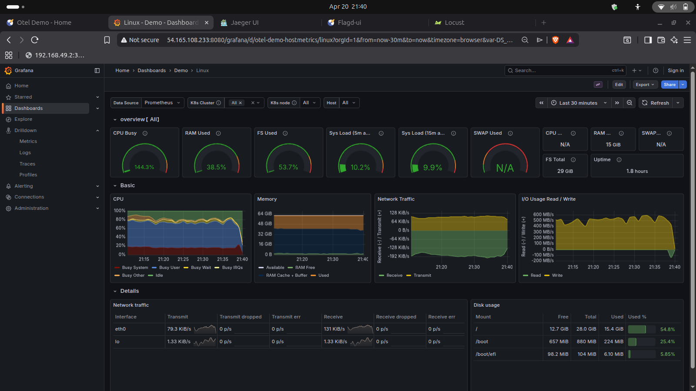
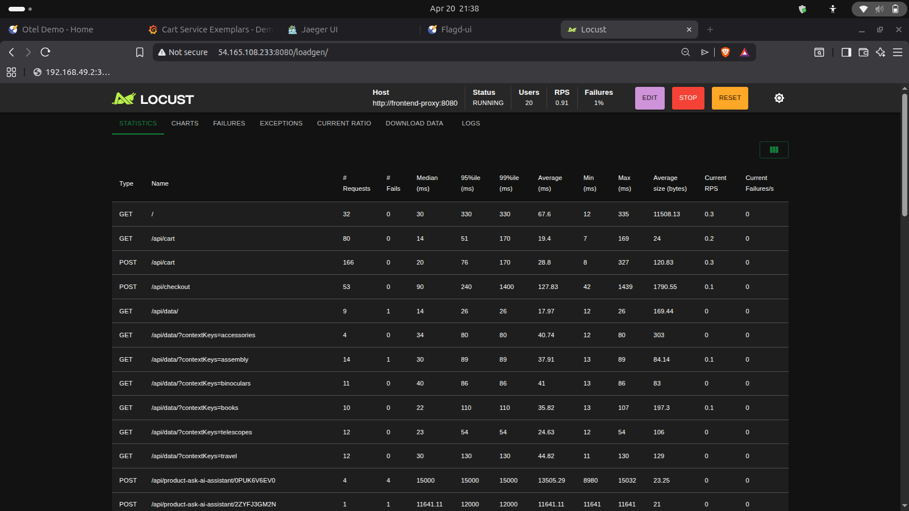
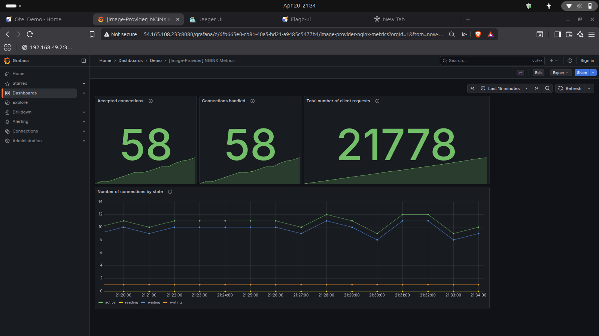
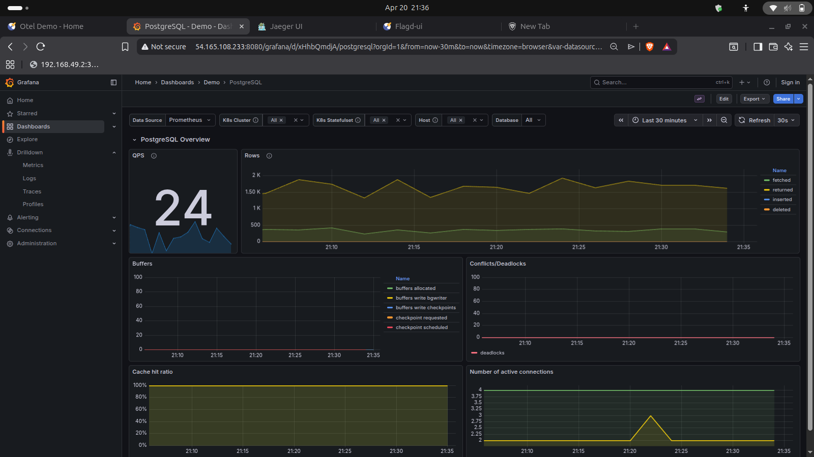
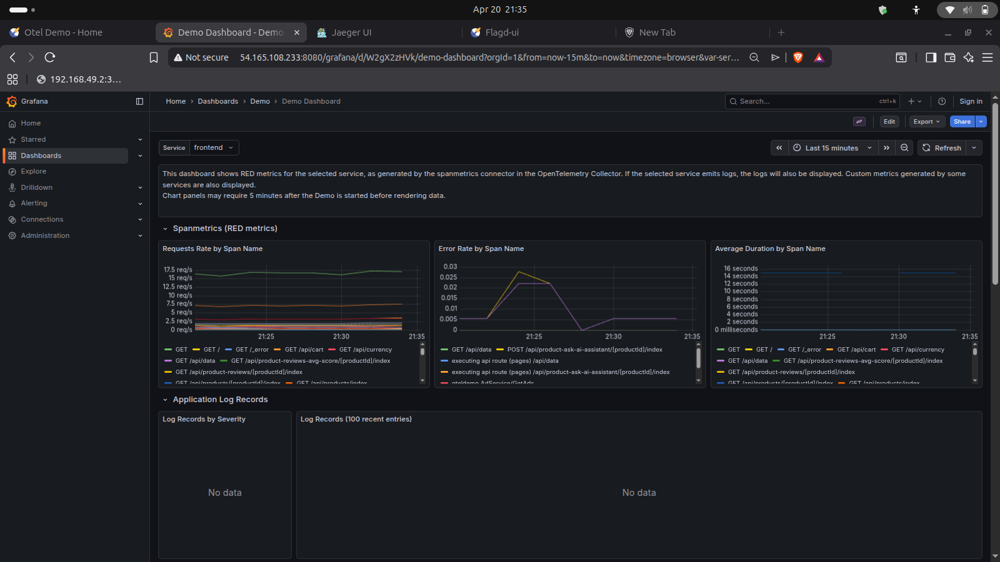

# OpenTelemetry Microservices Observability Demo

This project demonstrates observability implementation in a real-world microservice-based production system. It leverages the **OpenTelemetry demo project** and **AWS** to provide comprehensive monitoring, tracing, and metrics collection across distributed services.

### System Architecture


## Prerequisites

### AWS Instance Requirements

- **Instance Type**: Ubuntu t3.xlarge (or larger)
- **Minimum Memory**: 8GB (16GB recommended)
- **Minimum Storage**: 20GB
- **Network**: Enable ingress traffic on port 8080 in the security group

## Initial Setup

### 1. Install Docker

Run the provided installation script:

```bash
sh docker_install.sh
```

### 2. Configure Docker User Permissions

If you prefer not to use `sudo` for docker commands, add your user to the docker group:

```bash
sudo usermod -aG docker $USER
```

> **Note**: You may need to log out and log back in for this change to take effect.

## Configuration

### Observability Backend

By default, the system uses **Prometheus** as the observability backend. To specify a different backend vendor, edit the collector configuration file:

```
src/otel-collector/otelcol-config.yml
```

### Chaos Engineering & Testing with flagd

This project includes a **feature flag configuration file** (`src/flagd/demo.flagd.json`) that implements chaos engineering scenarios and testing simulations. These flags allow you to toggle various failure modes and load conditions to test system resilience and observe how the system behaves under different stress conditions.

#### Available Test Scenarios

**LLM Service Failures:**
- `llmInaccurateResponse` - Simulates inaccurate product summaries from the LLM
- `llmRateLimitError` - Introduces intermittent rate limit errors in the LLM service

**Catalog & Recommendations:**
- `productCatalogFailure` - Fails the product catalog service on specific products
- `recommendationCacheFailure` - Simulates cache failures in the recommendation service

**Advertising Service:**
- `adManualGc` - Triggers full manual garbage collection cycles
- `adHighCpu` - Simulates high CPU load in the ad service
- `adFailure` - Completely fails the ad service

**Message Queue:**
- `kafkaQueueProblems` - Overloads Kafka queue with consumer-side delays causing lag spikes

**Shopping & Payment:**
- `cartFailure` - Fails the shopping cart service
- `paymentFailure` - Simulates payment failures at various rates (100%, 90%, 75%, 50%, 25%, 10%)
- `paymentUnreachable` - Makes the payment service completely unavailable

**Frontend & Load Testing:**
- `loadGeneratorFloodHomepage` - Floods the frontend with high request volumes
- `imageSlowLoad` - Simulates slow image loading (5-10 seconds)
- `failedReadinessProbe` - Triggers readiness probe failures for the cart service

**Memory & Resource Issues:**
- `emailMemoryLeak` - Simulates memory leaks in the email service (configurable multiplier: 1x, 10x, 100x, 1000x, 10000x)

#### How to Use the Flags

Edit the `defaultVariant` values in `src/flagd/demo.flagd.json` to enable or disable specific chaos scenarios. Each flag is fully ENABLED, so you can switch variants without changing the state.

Example: To simulate a payment service failure at 50% rate:
```json
"paymentFailure": {
  "defaultVariant": "50%"
}
```

These flags provide excellent observability test cases, allowing you to:
- Monitor how the system recovers from failures
- Trace error propagation through the microservice architecture
- Observe metrics spikes and anomalies
- Test alerting and monitoring capabilities

## Running the Application

Start all containers with:

```bash
docker compose up --force-recreate --remove-orphans --detach
```

The application will be accessible at `http://<your-instance-ip>:8080`

## Troubleshooting

### Kafka Crashes

If Kafka crashes during startup:
- **Issue**: Insufficient RAM
- **Solution**: Ensure your instance has at least 8GB of RAM available (16GB recommended)

### Storage Issues

If you encounter "Not Enough Storage" errors:

1. Check current storage:
   ```bash
   df -h
   ```

2. Increase the volume via AWS Console or AWS CLI

3. Extend the partition (replace `${partitionname}` with your partition, e.g., `xvda1`):
   ```bash
   sudo growpart ${partitionname} 1
   ```

4. Resize the filesystem:
   ```bash
   sudo resize2fs ${partitionname}
   ```

### Docker Permission Denied

If you see permission errors without using `sudo`, ensure you've added your user to the docker group and logged out/in, or use `sudo` for all docker commands.

## Project Structure

- **src/**: Microservice applications in various languages (C#, Java, Go, Ruby, Elixir, etc.)
- **pb/**: Protocol buffer definitions
- **internal/tools/**: Supporting tools and utilities
- **telemetry-schema/**: OpenTelemetry schema definitions
- **test/**: Testing utilities and trace testing

## Architecture

This demo implements observability across multiple microservices including:
- Frontend services
- Shopping cart, checkout, and payment processing
- Product catalog and recommendations
- Fraud detection
- Email notifications
- Load generation for testing
- Telemetry collection and visualization

All services are instrumented with OpenTelemetry to provide complete visibility across the distributed system.

## Implementation Screenshots

### Docker Images Build


### Jaeger Distributed Traces


### Latency Heatmap


### Linux Infrastructure Metrics


### Locust Load Generator


### Nginx Connection Metrics


### PostgreSQL Database Metrics


### Span Metrics & Connector Metrics


## Notes

- Always ensure sufficient resources (CPU, memory, storage) before running the full stack
- The Kafka service is resource-intensive and requires adequate RAM
- Monitor resource usage regularly, especially in long-running deployments
